# Dotfiles

Personal dotfiles managed with [GNU Stow](https://www.gnu.org/software/stow/).

## Structure

### Visual Overview

```mermaid
graph TD
    A["🏠 dotfiles/"] --> B["📁 bash/"]
    A --> C["📁 zsh/"] 
    A --> D["📁 starship/"]
    A --> E["📁 tmux/"]
    A --> F["📁 p10k/"]
    A --> G["📁 lazygit/"]
    A --> H["📁 iterm/"]
    A --> I["⚙️ install.sh"]
    A --> J["🔧 setup.sh"]
    
    B --> B1[".bashrc → ~/.bashrc"]
    B --> B2[".bash_profile → ~/.bash_profile"]
    
    C --> C1[".zshrc → ~/.zshrc"]
    C --> C2[".zsh_aliases → ~/.zsh_aliases"]
    C --> C3[".zprofile → ~/.zprofile"]
    
    D --> D1["📁 .config/"]
    D1 --> D2["📁 starship/"]
    D2 --> D3["starship.toml → ~/.config/starship/starship.toml"]
    
    E --> E1[".tmux.conf → ~/.tmux.conf"]
    
    F --> F1[".p10k.zsh → ~/.p10k.zsh"]
    
    G --> G1["📁 .config/"]
    G1 --> G2["📁 lazygit/"]
    G2 --> G3["config.yml → ~/.config/lazygit/config.yml"]
    
    H --> H1[".hushlogin → ~/.hushlogin"]
    
    classDef folderStyle fill:#e1f5fe,stroke:#01579b,stroke-width:2px
    classDef fileStyle fill:#f3e5f5,stroke:#4a148c,stroke-width:1px
    classDef scriptStyle fill:#e8f5e8,stroke:#1b5e20,stroke-width:2px
    
    class A,B,C,D,E,F,G,H,D1,D2,G1,G2 folderStyle
    class B1,B2,C1,C2,C3,D3,E1,F1,G3,H1 fileStyle
    class I,J scriptStyle
```



### 📋 Traditional Tree View

```text
dotfiles/
├── bash/           # Bash configuration files
│   ├── .bashrc     # → ~/.bashrc
│   └── .bash_profile # → ~/.bash_profile
├── zsh/            # Zsh configuration files
│   ├── .zshrc      # → ~/.zshrc
│   ├── .zsh_aliases # → ~/.zsh_aliases
│   └── .zprofile   # → ~/.zprofile
├── starship/       # Starship prompt configuration
│   └── .config/
│       └── starship/
│           └── starship.toml  # → ~/.config/starship/starship.toml
├── tmux/           # Tmux configuration
│   └── .tmux.conf  # → ~/.tmux.conf
├── p10k/           # Powerlevel10k theme configuration
│   └── .p10k.zsh   # → ~/.p10k.zsh
├── lazygit/        # Lazygit configuration
│   └── .config/
│       └── lazygit/
│           └── config.yml  # → ~/.config/lazygit/config.yml
├── iterm/          # iTerm2 configuration
│   └── .hushlogin  # → ~/.hushlogin
├── install.sh      # Installation script
└── setup.sh        # Setup script for stowing packages
```

## Installation

### Quick Setup

1. **Clone this repository**:

   ```bash
   git clone https://github.com/your-username/dotfiles.git ~/.dotfiles
   cd ~/.dotfiles
   ```

2. **Make scripts executable**:

   ```bash
   chmod +x setup.sh install.sh
   ```

3. **Run the setup script** (handles all dependencies automatically):

   ```bash
   ./setup.sh
   ```

That's it! The setup script will:

- Install Homebrew (macOS) or detect your package manager (Linux)
- Install all required dependencies (stow, starship, tmux, lazygit, etc.)
- Create symbolic links for all dotfiles
- Set up additional configurations

### Alternative: Manual Installation

If you prefer to install dependencies separately:

```bash
# Make scripts executable
chmod +x setup.sh install.sh

# Install dependencies first
./install.sh

# Then stow the dotfiles
stow bash zsh starship tmux p10k lazygit iterm
```

## Manual Package Management

### Stowing Packages

You can stow packages individually or all at once:

```bash
# Stow specific packages
stow zsh
stow starship
stow tmux

# Stow all packages at once
stow bash zsh starship tmux p10k lazygit iterm
```

### Un-stowing Packages

To remove symlinks:

```bash
# Un-stow specific package
stow -D zsh

# Un-stow all packages
stow -D bash zsh starship tmux p10k lazygit iterm
```

## What's Included

- **Bash**: Basic bash configuration with profile setup
- **Zsh**: Comprehensive zsh configuration with aliases and profile
- **Starship**: Modern, fast shell prompt with custom configuration
- **Tmux**: Terminal multiplexer with custom key bindings and styling
- **Powerlevel10k**: Fast and flexible zsh theme configuration
- **Lazygit**: Simple terminal UI for git commands with custom config
- **iTerm2**: Basic terminal configuration (hushlogin)

## Notes

- All configurations are designed to work together harmoniously
- The setup creates symbolic links, so changes to files in this repo will be reflected immediately
- Backup your existing dotfiles before running the setup script
- Some configurations may require additional software installations (handled by `install.sh`)
